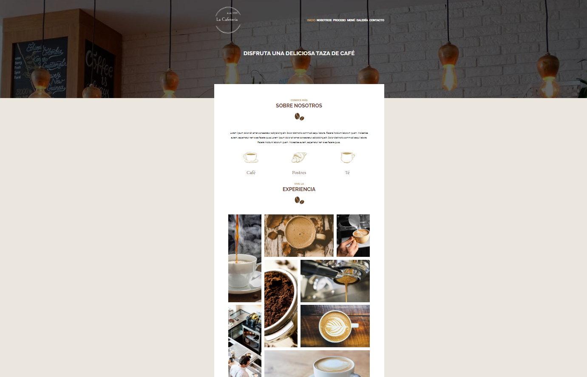

# cafeteria-scss-gulp

## Objetivo
+ Estructurar proyecto
+ Estilo mediante SCSS
+ Implementacion Gulp

### Tecnologias usadas:
* HTML5, CSS3, SASS, Gulp

### Visita el proyecto.

[Visita el proyecto](https://miguelpl32.github.io/cafeteria-scss-gulp/)

